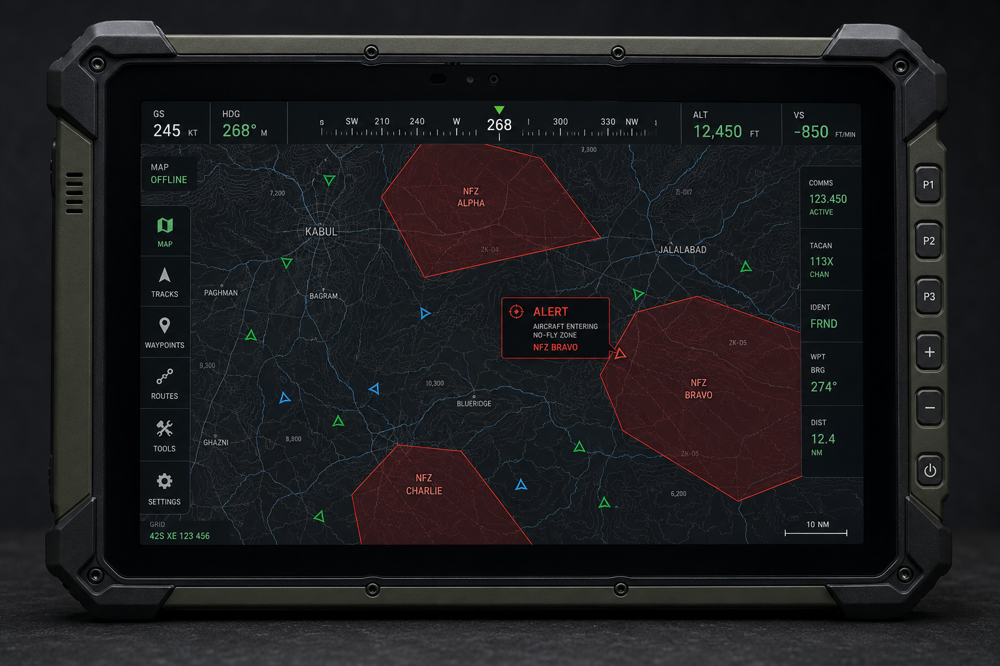
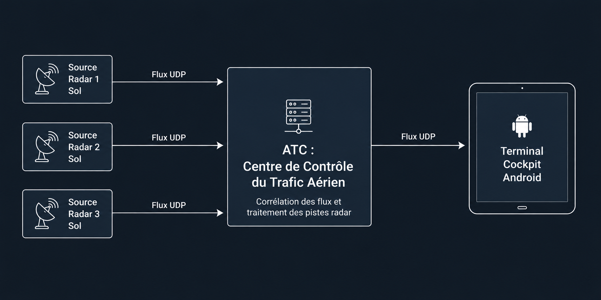
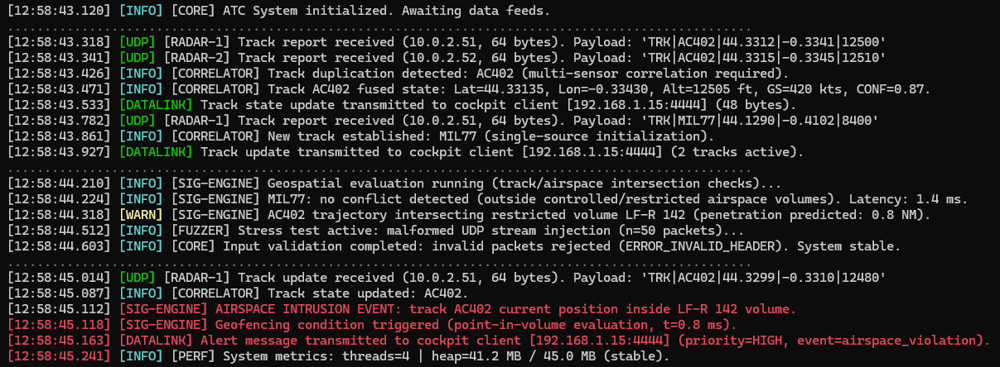

<div align="center">

# ✈️ TACTIC-NAV
### Tactical Air Navigation & Centre de Contrôle du Trafic Aérien

*Système embarqué de surveillance tactique en temps réel pour cockpits militaires*

---


</div>

---

## 1. Contexte du Projet

Dans le cadre de la modernisation des systèmes avioniques d'aéronefs militaires, le projet **TACTIC-NAV** vise à développer un prototype de système d'affichage tactique et de gestion des flux de données cartographiques en temps réel.

Le **Système de Traitement Central (ATC)** : Un serveur en Java pur qui fusionne en continu les flux de données provenant de plusieurs radars au sol. Il filtre les informations, calcule instantanément les trajectoires et diffuse automatiquement les pistes radar ainsi que les limites des zones d'exclusion (No-Fly Zones) géospatiales.

Le **Terminal Embarqué (Cockpit)** : Une application Java Android 13 native installée sur une tablette. Connectée en continu au Système de Traitement Central (ATC), elle reçoit le flux de données tactiques en temps réel pour le restituer visuellement sur un fond de carte épuré stocké localement (Offline, sans aucune dépendance à Internet).

### 📸 Aperçu Global du Système

<table width="100%">
  <tr>
    <td width="33%" align="center"><b>1. Terminal Embarqué (Cockpit)</b></td>
    <td width="33%" align="center"><b>2. Architecture des Flux</b></td>
    <td width="33%" align="center"><b>3. Centre de Contrôle (ATC)</b></td>
  </tr>

  <tr>
    <td>
      
    </td>
    <td>
      
    </td>
    <td>
      
    </td>
  </tr>

  <tr>
    <td><small><i>Application Android native utilisant le moteur <b>Mapsforge</b> pour un rendu tactique fluide 100% Offline.</i></small></td>
    <td><small><i>Pipeline de données synoptique : des sources radars sol jusqu'à la diffusion UDP vers la tablette du cockpit.</i></small></td>
    <td><small><i>Console Java Core en action : logs en temps réel illustrant la corrélation des flux et la détection d'alertes SIG.</i></small></td>
  </tr>
</table>

---

## 2. Architecture Technique & Schéma Réseau

Le système repose sur deux composants indépendants communiquant au sein d'un réseau local privatif via des flux de données UDP :

- **Le Système de Traitement Central (ATC)** : Une application Java Core développée sans framework lourd (ni Spring, ni Quarkus). Elle écoute en parallèle plusieurs flux provenant de différents radars au sol, consolide les coordonnées des cibles aériennes reçues et diffuse la situation globale ainsi que les zones de restriction géospatiales.
- **Le Terminal Embarqué (Cockpit)** : Une application Android native écrite en Java pur, conçue pour équiper les tablettes tactiles des cockpits afin de restituer graphiquement l'environnement tactique.

### Schéma des flux réseau

```
[ Radar Sol 1 ] ───(UDP)───┐
[ Radar Sol 2 ] ───(UDP)───┼─► [ ATC : Centre de Contrôle du Trafic Aérien ] ───(UDP)───► [ COCKPIT : Terminal Embarqué Android ]
[ Radar Sol N ] ───(UDP)───┘
                                │                                               │
                            Multi-threads d'écoute                          Thread Réseau dédié
                            Consolidation géospatiale                       Moteur SIG Hors-ligne
```

---

## 3. Contraintes de l'Embarqué Critique & Sûreté

Ces contraintes s'appliquent en priorité au **Terminal Embarqué (Cockpit)**, qui doit rester fluide sur tablette Android avec une carte hors-ligne et un rendu temps réel. Le **serveur ATC**, exécuté sur poste sol Java Core, privilégie plutôt la séparation des couches, la cohérence des snapshots, la fusion déterministe des pistes et une stratégie claire de backpressure UDP.

### Cockpit : maîtrise mémoire et fluidité

Le cockpit limite les allocations dans les boucles de rendu et de calcul géospatial afin d'éviter les pauses visibles dues au *Garbage Collector*. Les structures réutilisables sont pertinentes côté affichage, carte et diagnostic embarqué.

### ATC : robustesse serveur

L'ATC rejette les paquets radar invalides, maintient un modèle de piste cohérent malgré l'ordre non garanti d'UDP, et diffuse des snapshots tactiques consistants sans bloquer le moteur de fusion. Les erreurs réseau ou de parsing sont isolées et journalisées, sans imposer de modèle `Result<T, Error>` global.

### Indicateurs de Performance (KPIs)

| Métrique | Seuil |
|---|---|
| **Temps de démarrage** | Application prête et carte chargée en **< 1.2 seconde** |
| **Empreinte RAM Cockpit** | Consommation stabilisée sous la barre des **45 Mo de Heap** (courbe plate) |
| **Latence Cockpit** | Traitement complet d'un message reçu, calcul géospatial et rendu en **< 30 millisecondes** |
| **ATC** | Fusion déterministe, snapshots cohérents et diffusion UDP non bloquante ; pas de contrainte stricte à 45 Mo |

---

## 4. Architecture et Abstraction du Moteur Cartographique

Afin de garantir la compatibilité du système avec les standards cartographiques de la défense (tels que la suite logicielle industrielle **Luciad**), le projet met en œuvre une architecture hautement découplée reposant sur l'**Inversion de Dépendance** (principes SOLID) :

- L'application Android interagit exclusivement avec une interface d'abstraction baptisée `TacticalMapEngine`.
- Pour cette démonstration grand public, l'interface est concrétisée par la bibliothèque open-source **Mapsforge** (ou **Osmdroid**), configurée pour lire localement un fichier de carte pré-téléchargé au format `.map` (région Nouvelle-Aquitaine).
- Cette modularité permet de basculer sur n'importe quel autre SDK cartographique propriétaire par simple injection de dépendance, sans modifier la logique métier sous-jacente.

> 📸 *Capture de l'affichage cockpit (région Nouvelle-Aquitaine · Mont-de-Marsan) à venir*

---

## 5. Spécifications Fonctionnelles & Multithreading

Le système gère le traitement des flux de manière hautement asynchrone :

### Collecte Concurrente (ATC Sol)

Le Système de Traitement Central dédie un thread à chaque source radar pour écouter en parallèle et intercepter les données de positionnement sans interférence.

### Pipeline d'Affichage (Cockpit)

| Thread | Rôle |
|---|---|
| **Thread Réseau** | Intercepte en continu les paquets de données (positions des pistes et limites des zones d'exclusion). |
| **Thread de Calcul (Worker)** | Décode les trames et calcule l'intersection géospatiale (algorithme *Point-in-Polygon* reposant sur la formule de **Haversine**) pour détecter si un aéronef pénètre une zone interdite. |
| **Thread UI** | Consomme les données prêtes pour mettre à jour la carte en maintenant un taux de rafraîchissement fluide de **30 FPS** minimum. |

---

## 6. Stratégie de Tests Automatisés "Anti-Crash"

La stabilité et la sûreté de fonctionnement sont validées par une suite de tests automatisés exigeants :

### Fuzzing de Données Réseau

Un test de stress injecte en continu des données corrompues, tronquées ou hors-normes via des flux concurrents. Le système doit rejeter proprement ces anomalies sans propager de `NullPointerException`, `ArrayIndexOutOfBoundsException` ou erreur réseau fatale vers les traitements applicatifs.

### Robustesse aux Coupures de Flux

Simulation d'une perte totale et intermittente du signal. L'IHM doit maintenir l'affichage cartographique gelé sur le dernier état stable connu, sans aucun blocage du thread d'interface principal.

---

## 7. Validation Finale : "Opération MISTRAL"

Ce protocole valide le comportement du système en conditions réelles d'utilisation à travers le scénario de démonstration appelé **"Opération MISTRAL"**.

### Configuration de l'environnement

La démonstration s'effectue en environnement isolé : un PC portable (Système de Traitement Central ATC) communique avec une tablette Android (Cockpit) privée de toute connexion Internet. Les deux machines interagissent via un point d'accès Wi-Fi local fermé.

> 📸 *Captures de la démonstration à venir*

---

<details>
<summary><b>Phase 1 — Le Démarrage "À Froid"</b> · Vitesse et Autonomie</summary>

| Élément | Description |
|---|---|
| **Action** | Lancement de l'application sur la tablette déconnectée. |
| **Résultat** | Rendu visuel immédiat (< 1s) de la topographie de la Nouvelle-Aquitaine centrée sur la zone aéronautique de Mont-de-Marsan, de manière 100 % autonome. |
| **Validation** | Le chargement SIG autonome et la rapidité de démarrage sont validés. |

</details>

<details>
<summary><b>Phase 2 — L'Activation des Flux Radars</b> · Concurrence</summary>

| Élément | Description |
|---|---|
| **Action** | Démarrage du simulateur de radars sol sur le Système de Traitement Central. Envoi simultané de la configuration géométrique de la zone de non-survol (No-Fly Zone) et des trajectoires de **50 cibles mobiles**. |
| **Résultat** | Le polygone de sécurité se dessine à l'écran, immédiatement suivi par l'apparition et le déplacement fluide et asynchrone des 50 appareils aériens. |
| **Validation** | La réception réseau asynchrone par thread dédié et l'affichage concurrent fonctionnent sans conflit. |

</details>

<details>
<summary><b>Phase 3 — Manipulation sous Stress</b> · Zéro-Allocation &amp; Fluidité</summary>

| Élément | Description |
|---|---|
| **Action** | Sollicitation intensive et rapide de l'IHM tactile (zooms et déplacements continus de la carte). |
| **Résultat** | L'affichage reste parfaitement réactif (30 FPS constants) sans aucune saccade. Le profileur de performances affiche une consommation mémoire plate et verrouillée sous la barre des 45 Mo. |
| **Validation** | L'efficacité du système de recyclage d'objets (`ObjectPool`) est démontrée. Le *Garbage Collector* n'interrompt jamais l'application. |

</details>

<details>
<summary><b>Phase 4 — L'Alerte d'Intrusion Géospatiale</b> · Calcul SIG</summary>

| Élément | Description |
|---|---|
| **Action** | Le scénario amène une piste identifiée comme suspecte (couleur rouge) à franchir la frontière de la zone de non-survol. |
| **Résultat** | À la milliseconde précise du franchissement, l'icône de l'appareil clignote intensément et une alerte de sécurité s'affiche instantanément (< 30 ms) sur la console du cockpit. |
| **Validation** | Les algorithmes de projection et d'intersection géospatiale à basse latence sont validés. |

</details>

<details>
<summary><b>Phase 5 — Résilience aux Perturbations</b> · Robustesse Sûreté</summary>

| Élément | Description |
|---|---|
| **Action** | Extinction brutale du Système de Traitement Central ATC au milieu des opérations pour simuler une perte de liaison ou un brouillage. |
| **Résultat** | L'application Android ne plante pas. Un voyant de diagnostic passe au rouge ("FLUX COMPROMIS") et les pistes s'immobilisent sur leur dernière coordonnée valide. Dès le redémarrage du serveur, le flux est capté à nouveau et les appareils reprennent leur course de façon transparente. |
| **Validation** | La couche réseau isole la panne, le cockpit conserve le dernier snapshot valide et la tolérance aux perturbations est confirmée. |

</details>
